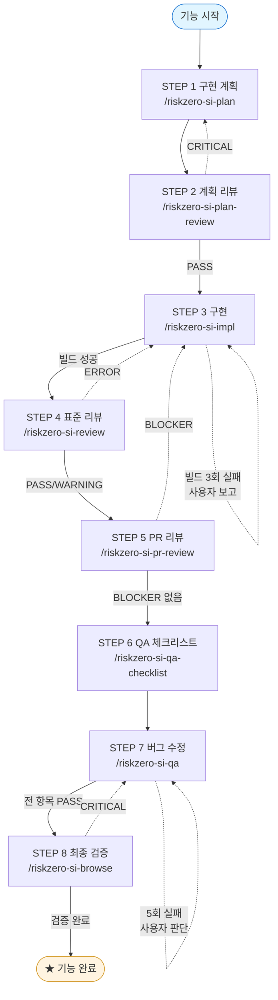
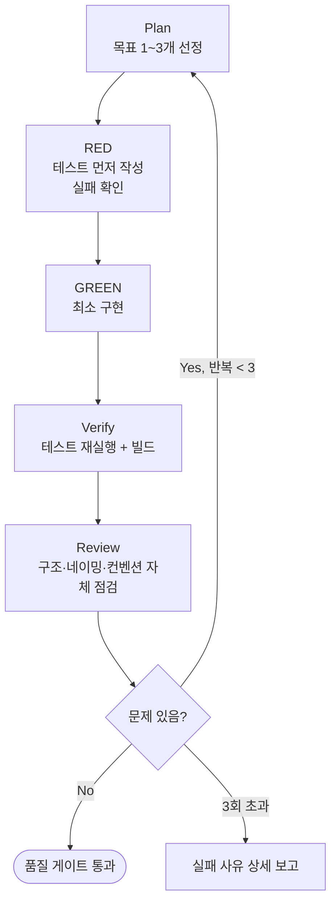

# riskzero-si 개발 워크플로우 — SI 파이프라인 실무자를 위한 표준 매뉴얼

**v0.2 (RELEASE)** — 이 파일은 스킬 repo에 동거하며 스킬 셋과 **같은 커밋**이 곧 기준 버전이다. `/riskzero-si-help`가 이 문서를 데이터 소스로 사용한다.

---

## 들어가는 글

riskzero-si는 **기획서 + 퍼블리싱 + DDL** 세 가지 입력으로 SI 기능 하나를 계획 → 구현 → 리뷰 → QA → 최종 검증까지 끌고 가는 8단계 파이프라인이다. 이 매뉴얼은 Riskzero SI 프로젝트 개발팀이 AI 에이전트(Claude Code / Codex)로 게시판형 CRUD 기능을 안정적으로 양산하기 위한 사내 표준 워크플로우를 책으로 묶은 것이다.

본 매뉴얼이 답하는 질문은 다음 셋이다.

- **무엇으로** 기능을 시작하는가 (기획서·퍼블리싱·DDL — 입력 소스의 준비)
- **어떻게** 만들어야 게이트를 통과하고 ship 할 수 있는가 (STEP 1~8의 표준 흐름)
- **누가 무엇으로** 그 작업을 도와주는가 (riskzero-si 9개 스킬 + gstack 래핑의 역할 구분)

세 질문에 답이 모이는 한 사이클을 본 매뉴얼은 *기능(feature)* 이라 부른다. 기능은 STEP 1부터 STEP 8까지 흐른다. 그 흐름이 PART II의 척추다.

---

## 이 책을 읽는 법

### 처음 펴는 독자

다음 순서로 읽는다.

1. PART I 기본기 — 멘탈 모델을 먼저 갖춘다 (1~3장)
2. PART I 4장 첫 30분 — 도구 설치와 `--init`
3. PART I 5장 첫 기능 — 한 기능 완주 narrative
4. PART II 6~14장 — 매 기능 반복할 STEP 0~8

이 4단계가 끝나면 일상 작업이 가능하다. PART III 이후는 *필요할 때 펴는* 자료다.

### 일상 작업 중인 독자

작업 중에는 다음 두 자료만 옆에 둔다.

- **PART II** — 현재 STEP 챕터
- **PART VI 참조** — 명령·라우팅·트러블슈팅

PART III은 표준 전체 실행을 벗어날 때 (구간 실행 · 역할별 축약 · BE/FE 분리 · 단독 스킬) 해당 챕터만 본다.

### 가이드 유지보수자

본 매뉴얼은 **스킬 repo에 동거**한다 (`github.com/wody-hub/riskzero-riskzero-si`/GUIDE.md). 각 스킬의 동작 정의는 SKILL.md가 우선하며, 본 매뉴얼은 그것을 사용자 관점으로 풀어쓴 것이다. **스킬을 바꾸는 커밋에 GUIDE.md 갱신을 함께 포함**하라 — 같은 커밋으로 묶이므로 문서-스킬 버전 어긋남(stale)이 구조적으로 방지된다. 로컬 수정은 git pull로 소실되니 반드시 upstream 커밋으로. 부록 J에 이력을 기록한다.

---

## 5일 마스터 로드맵

새로 합류한 개발자가 5일 동안 따라가는 학습 곡선이다.

| 일차 | 학습 목표 | 읽을 챕터 | 산출 |
|---|---|---|---|
| **Day 1 오전** | 도구 설치 + 프로젝트 `--init` | 1~4장 (PART I) | 환경 셋업 + si-config.yml 생성 완료 |
| **Day 1 오후** | 멘탈 모델 정착 — 8단계와 게이트 | 3장 정독 | lifecycle 다이어그램을 보지 않고 그릴 수 있음 |
| **Day 2~3** | 한 기능 시범 완주 (전체 파이프라인) | 5장 + 6~14장 참조 | 시범 기능 1개 — `/riskzero-si-pipeline {기능명}` 완주 |
| **Day 4** | 단계별 단독 실행 익히기 | PART III 15·18장 | `--from/--to` 구간 실행 1회, 단독 스킬 호출 2회 |
| **Day 5** | 게이트 실패·복귀 대응 + 사례 학습 | PART IV 20장 + PART V 사례 1 | 리뷰 FAIL → 복귀 → 재통과 경험 1회 |

Day 5 종료 시점 = "선임에게 묻지 않고 기능 단위 ship 가능".

---

## 목차

### PART I · 기본기

- 1장 [왜 이렇게 일하는가](#1장--왜-이렇게-일하는가)
- 2장 [구성 요소 — riskzero-si / gstack / si-config](#2장--구성-요소--riskzero-si--gstack--si-config)
- 3장 [기능 lifecycle 한눈에](#3장--기능-lifecycle-한눈에)
- 4장 [첫 30분 — 셋업과 --init](#4장--첫-30분--셋업과---init)
- 5장 [첫 기능 — 한 기능 완주](#5장--첫-기능--한-기능-완주)

### PART II · 표준 작업 흐름

- 6장 [STEP 0 · 프로젝트 셋업과 입력 소스 준비](#6장--step-0--프로젝트-셋업과-입력-소스-준비)
- 7장 [STEP 1 · 구현 계획 — 두뇌풀가동](#7장--step-1--구현-계획--두뇌풀가동)
- 8장 [STEP 2 · 계획 리뷰](#8장--step-2--계획-리뷰)
- 9장 [STEP 3 · 구현 — 코드노예](#9장--step-3--구현--코드노예)
- 10장 [STEP 4 · 프로젝트 표준 리뷰](#10장--step-4--프로젝트-표준-리뷰)
- 11장 [STEP 5 · PR diff 리뷰](#11장--step-5--pr-diff-리뷰)
- 12장 [STEP 6 · QA 체크리스트](#12장--step-6--qa-체크리스트)
- 13장 [STEP 7 · 버그 조사와 수정](#13장--step-7--버그-조사와-수정)
- 14장 [STEP 8 · 브라우저 최종 검증](#14장--step-8--브라우저-최종-검증)

### PART III · 상황별 응용

- 15장 [구간 실행 — --from / --to](#15장--구간-실행----from----to)
- 16장 [역할별 사용 패턴](#16장--역할별-사용-패턴)
- 17장 [BE / FE 분리 작업](#17장--be--fe-분리-작업)
- 18장 [파이프라인 밖에서 — 단독 스킬 사용](#18장--파이프라인-밖에서--단독-스킬-사용)
- 19장 [일반 작업과의 경계 — 언제 쓰지 않는가](#19장--일반-작업과의-경계--언제-쓰지-않는가)

### PART IV · 심화 — 품질과 안전

- 20장 [게이트와 복귀 루프](#20장--게이트와-복귀-루프)
- 21장 [TDD + Ralph-loop 심화](#21장--tdd--ralph-loop-심화)
- 22장 [안전장치 — 서버 게이트와 파일 충돌 확인](#22장--안전장치--서버-게이트와-파일-충돌-확인)

### PART V · 사례 연구

- 사례 1 [게시판형 CRUD 기능 전체 완주](#사례-1--게시판형-crud-기능-전체-완주)
- 사례 2 [기존 화면 버그만 수정 (--from=7)](#사례-2--기존-화면-버그만-수정---from7)
- 사례 3 [QA 담당자의 검증 전용 흐름](#사례-3--qa-담당자의-검증-전용-흐름)

### PART VI · 참조

- 부록 A [Hard Rules](#부록-a--hard-rules)
- 부록 B [라우팅 사전 — 트리거 키워드](#부록-b--라우팅-사전--트리거-키워드)
- 부록 C [Runtime 설치 (Codex / Claude Code)](#부록-c--runtime-설치-codex--claude-code)
- 부록 D [명령 surface 전체](#부록-d--명령-surface-전체)
- 부록 E [디렉토리 구조](#부록-e--디렉토리-구조)
- 부록 F [글로서리 (가나다순)](#부록-f--글로서리-가나다순)
- 부록 G [트러블슈팅](#부록-g--트러블슈팅)
- 부록 H [Anti-pattern 사례](#부록-h--anti-pattern-사례)
- 부록 I [모델 전략 — 단계별 권장 모델](#부록-i--모델-전략--단계별-권장-모델)
- 부록 J [변경 이력](#부록-j--변경-이력)

---

═══════════════════════════════════════════════════════════════════════════════
# PART I · 기본기
═══════════════════════════════════════════════════════════════════════════════

> 멘탈 모델 형성 단계. 파이프라인의 *왜*와 *어떻게*를 먼저 갖춘 뒤 일상 작업에 들어간다.

---

## 1장 · 왜 이렇게 일하는가

AI 에이전트에게 SI 기능 개발을 맡길 때 *제멋대로 코드를 쓰지 못하게* 막는 표준 절차가 필요한 이유를 설명한다.

**읽는 시간** 5분 · **사용 시점** 매뉴얼을 처음 펴는 순간. 동료가 "왜 8단계나 돼?"라고 물을 때 인용 자료로. · **사전 지식** 없음

### 1.1 SI 프로젝트의 반복성과 AI의 양면성

SI 프로젝트의 화면 개발은 대부분 **게시판형 CRUD의 변주**다 — 목록·검색·등록·수정·삭제·페이징. 패턴이 반복되므로 AI 자동화 효율이 극대화되는 영역이지만, 동시에 다음 세 가지가 자주 무너진다.

1. **프로젝트 표준 이탈** — AI가 일반적인 Best Practice로 코드를 쓰면 프로젝트 README의 컨벤션(DTO/VO 분리, 패키지 구조, 공통코드 처리)과 어긋난다.
2. **근거 없는 설계** — 기획서 어디, DDL 어디에서 왔는지 추적되지 않는 필드·로직이 생긴다.
3. **검증 없는 완료 선언** — "구현했습니다"와 "동작합니다"는 다르다. 브라우저에서 확인하기 전까지는 끝난 게 아니다.

### 1.2 파이프라인의 약속

riskzero-si는 위 세 실패를 각각 다음으로 막는다.

| 실패 | 방어 장치 | 단계 |
|---|---|---|
| 프로젝트 표준 이탈 | README.md 우선 원칙 + 표준 리뷰 | STEP 1 · 4 |
| 근거 없는 설계 | 모든 설계 항목에 근거(기획서/DDL 출처) 명시 + 계획 리뷰 | STEP 1 · 2 |
| 검증 없는 완료 | TDD RED 증거 + QA 체크리스트 + 브라우저 증적 | STEP 3 · 6~8 |

핵심 원칙 네 가지 (파이프라인 전체를 지배한다):

- 각 단계의 산출물은 다음 단계의 입력이 된다
- 리뷰 단계에서 문제가 발견되면 **이전 단계로 되돌아간다**
- 모든 산출물은 기능별 산출물 디렉토리(`.si-planning/{기능명}/`)에 저장한다
- **사용자 확인 없이 다음 단계로 넘어가지 않는다**

---

## 2장 · 구성 요소 — riskzero-si / gstack / si-config

riskzero-si는 *단계와 게이트를 아는 SI 전문 PM*, gstack은 *조사·리뷰·브라우저 조작을 잘하는 외부 용역*, si-config.yml은 *프로젝트의 신분증*. 셋의 역할 분담을 머릿속에 그린다.

**읽는 시간** 8분 · **사용 시점** 어떤 명령이 어느 단계에서 무엇을 부르는지 헷갈릴 때 · **사전 지식** 1장

### 2.1 riskzero-si — SI 전문 PM 역할

9개 스킬로 구성된다. 1개 오케스트레이터(`/riskzero-si-pipeline`)가 8개 단계 스킬을 순차 호출하며, 단계 간 데이터 흐름과 게이트(진행/중단/복귀 판단)를 관리한다. 각 단계 스킬은 단독 호출도 가능하다(18장).

### 2.2 gstack — 외부 용역 역할

riskzero-si의 4개 스킬은 범용 작업을 gstack에 **얇은 위임**으로 넘긴다. riskzero-si가 프로젝트 맥락(설정·체크리스트·표준)을 준비하고, 실제 범용 작업은 gstack이 수행한다.

| riskzero-si 스킬 | 내부 사용 gstack 스킬 | 위임하는 일 |
|---|---|---|
| `/riskzero-si-plan-review` | `/plan-eng-review` | 아키텍처·데이터 흐름·엣지 케이스 리뷰 |
| `/riskzero-si-pr-review` | `/review` | diff 기반 안전성 리뷰 |
| `/riskzero-si-qa` | `/investigate` + `/qa` | 원인 조사 + 수정·재검증 |
| `/riskzero-si-browse` | `/browse` + `/qa-only` | 헤드리스 브라우저 검증 |

> ⚠ gstack이 설치되어 있지 않으면 위 4개 단계가 실패한다. 설치는 부록 C.

### 2.3 si-config.yml — 프로젝트 신분증

프로젝트별 설정 파일. 입력 소스 경로(기획서/퍼블리싱/DDL/샘플), 서버 포트, 인증 방식, 프레임워크, 빌드 명령을 담는다. 모든 스킬은 시작 시 이 파일을 다음 순서로 탐색한다.

```
1. .codex/si-config.yml     (Codex 권장 위치)
2. .claude/si-config.yml    (Claude Code 권장 위치)
3. si-config.yml            (프로젝트 루트)
4. .codex/qa-config.yml     (QA 전용 설정 호환)
5. .claude/qa-config.yml    (QA 전용 설정 호환)
```

`/riskzero-si-pipeline --init`이 프로젝트 구조를 자동 감지해 생성한다(6장).

### 2.4 셋이 협력하는 한 컷

```mermaid
%%{init: {'theme':'default', 'themeVariables': {'fontSize':'20px'}, 'flowchart':{'nodeSpacing':60, 'rankSpacing':80, 'padding':20, 'curve':'basis'}}}%%
flowchart TD
    User([개발자]) -->|"/riskzero-si-pipeline {기능명}"| Pipe[riskzero-si-pipeline<br/>오케스트레이터]
    Config[(si-config.yml)] -.설정 공급.-> Pipe
    Pipe --> S1[plan] --> S2[plan-review] --> S3[impl] --> S4[review]
    S4 --> S5[pr-review] --> S6[qa-checklist] --> S7[qa] --> S8[browse]
    S2 -.위임.-> G1[gstack<br/>plan-eng-review]
    S5 -.위임.-> G2[gstack<br/>review]
    S7 -.위임.-> G3[gstack<br/>investigate + qa]
    S8 -.위임.-> G4[gstack<br/>browse + qa-only]
    S8 --> Out[(.si-planning/{기능명}/<br/>산출물 일체)]

    classDef gstack fill:#f0f0f0,stroke:#888
    class G1,G2,G3,G4 gstack
```

---

## 3장 · 기능 lifecycle 한눈에

입력 소스 → STEP 1~8 → 산출물 디렉토리의 전체 흐름과 게이트 복귀 경로를 한 장 다이어그램으로 본다.

**읽는 시간** 7분 · **사용 시점** "내가 지금 어느 단계인가?"가 흐릿할 때 · **사전 지식** 1~2장

### 3.1 lifecycle 한눈에

| 단계 | 스킬 | 내용 | 챕터 | 반복 단위 |
|---|---|---|---|---|
| **STEP 0** | `--init` | 프로젝트 셋업 / 입력 소스 준비 | 6장 | 프로젝트당 1회 |
| ▼ | | | | |
| **STEP 1** | `/riskzero-si-plan` | 논의 + 선택적 리서치 + 구현/TDD 계획 | 7장 | 매 기능 반복 |
| **STEP 2** | `/riskzero-si-plan-review` | 계획 아키텍처/보안 리뷰 | 8장 | 매 기능 반복 |
| **STEP 3** | `/riskzero-si-impl` | TDD 기반 FE/BE 코드 구현 | 9장 | 매 기능 반복 |
| **STEP 4** | `/riskzero-si-review` | 프로젝트 표준 준수 리뷰 | 10장 | 매 기능 반복 |
| **STEP 5** | `/riskzero-si-pr-review` | PR diff 안전성 리뷰 | 11장 | 매 기능 반복 |
| **STEP 6** | `/riskzero-si-qa-checklist` | QA 체크리스트 생성 | 12장 | 매 기능 반복 |
| **STEP 7** | `/riskzero-si-qa` | 버그 조사 + 수정 | 13장 | 매 기능 반복 |
| **STEP 8** | `/riskzero-si-browse` | 브라우저 최종 검증 + 증적 | 14장 | 매 기능 반복 |
| ▼ | | | | |
| **순환** | | 다음 기능 → 다시 STEP 1 | | |

### 3.2 기능 한 사이클의 흐름 (게이트 포함)



### 3.3 결정 트리 — "지금 무엇을 하려는가?"

| 하려는 일 | 진입점 | 챕터 |
|---|---|---|
| 새 기능을 처음부터 끝까지 | `/riskzero-si-pipeline {기능명}` | PART II 전체 |
| 계획만 세우고 직접 구현 | `/riskzero-si-plan {기능명}` | 7장 + 16장 |
| 이미 구현된 코드의 표준 점검 | `/riskzero-si-review [경로]` | 10장 + 18장 |
| QA 체크리스트로 버그만 수정 | `/riskzero-si-pipeline {기능명} --from=7` | 사례 2 |
| 화면 검증만 (QA 담당) | `/riskzero-si-qa-checklist` → `/riskzero-si-browse` | 사례 3 |
| riskzero-si와 무관한 일반 작업 | **이 파이프라인을 쓰지 않는다** | 19장 |

---

## 4장 · 첫 30분 — 셋업과 --init

Claude Code 또는 Codex 기준으로 두 도구(gstack → riskzero-si)를 30분 안에 설치하고 첫 `--init`을 호출한다.

**읽는 시간** 10분 (실 셋업 30분) · **사용 시점** 새 프로젝트 시작 / 신규 입사자 첫날 / 환경 재설치 · **사전 지식** 1~3장

### 4.1 사전 점검

| 항목 | 버전 | 용도 |
|---|---|---|
| Codex 또는 Claude Code | 최신 | AI 코딩 어시스턴트 (host) |
| Bun | v1.0+ | gstack 빌드/실행 |
| gstack | 최신 | 브라우저 자동화, 리뷰 등 (riskzero-si의 의존성) |

### 4.2 두 도구 설치

> 상세 절차와 host별 명령은 **부록 C (★)** 가 기준이다. 요약:

```bash
# ① gstack (최초 1회)
git clone https://github.com/garrytan/gstack.git ~/gstack
cd ~/gstack && ./setup --host claude        # Codex면 --host codex

# ② riskzero-si
git clone https://github.com/wody-hub/riskzero-riskzero-si.git ~/riskzero-si
cd ~/riskzero-si && ./setup --host claude   # Codex면 --host codex
```

설치 후 **새 세션으로 재시작**한 뒤 `/riskzero-si-pipeline`이 인식되는지 확인한다.

### 4.3 프로젝트 1회 설정 — --init

```
/riskzero-si-pipeline --init
```

프로젝트 구조를 자동 감지(package.json / build.gradle / pom.xml / DDL 디렉토리 / 샘플 코드)하여 `.claude/si-config.yml`(또는 `.codex/si-config.yml`)을 생성한다. 자동 감지가 불확실한 항목은 빈 값 + 주석으로 남으므로, **생성 직후 반드시 검토**한다 — 특히 `sources.*`(기획서/퍼블리싱/DDL 경로)와 `auth.*`는 수동 확인이 필요한 경우가 많다.

### 4.4 동작 확인

새 세션에서 스킬 목록에 `riskzero-si-*` 9개가 보이고, si-config.yml의 `sources.wireframe` 경로에 실제 기획서 파일이 있으면 준비 완료.

### 4.5 첫 명령 호출

```
/riskzero-si-pipeline {기능명}
```

또는 시범적으로 STEP 1만:

```
/riskzero-si-plan {기능명}
```

---

## 5장 · 첫 기능 — 한 기능 완주

본 매뉴얼을 따라 처음으로 한 기능(STEP 1~8)을 완주한다. 2일 narrative.

**읽는 시간** 15분 (실 작업 1~2일) · **사용 시점** 4장 완료 직후, 시범 기능 시작 전 · **사전 지식** 1~4장

### 5.1 Day 1 오전 — STEP 1·2 (계획과 리뷰)

`/riskzero-si-plan 공지사항관리`를 호출한다. AI가 기획서·퍼블리싱·DDL을 읽고 gray area를 논의해온다 — **여기서 대충 답하지 않는다.** 논의 결과는 `discussion.md`에 굳는다. 리서치 필요성을 물으면 외부 라이브러리·복잡한 패턴이 없는 한 스킵해도 된다. `implementation-plan.md`와 `tdd-plan.md`가 나오면 직접 읽고 승인한다.

이어 `/riskzero-si-plan-review`. CRITICAL이 나오면 STEP 1로 돌아가 계획을 고친다 — 귀찮아도 여기서 고치는 것이 STEP 3 이후에 고치는 것보다 10배 싸다.

### 5.2 Day 1 오후 — STEP 3·4·5 (구현과 코드 리뷰)

`/riskzero-si-impl 공지사항관리`. 구현 시작 전 생성/수정 파일 목록을 보여주며 덮어쓰기 확인을 요청한다(22장). BE → FE 순서로 TDD Ralph-loop가 돈다. 빌드가 통과하면 `/riskzero-si-review`(표준)와 `/riskzero-si-pr-review`(안전성)를 차례로 통과시킨다.

### 5.3 Day 2 — STEP 6·7·8 (QA와 최종 검증)

`/riskzero-si-qa-checklist 공지사항관리`로 등록/수정/검색/페이징/네비게이션/삭제 체크리스트를 생성한다. 더미데이터 생성을 선택하면 **대상 서버 확인 게이트**가 뜬다 — 개발 서버인지 반드시 확인하고 진행한다(22장). `/riskzero-si-qa`로 FAIL 항목을 수정하고, `/riskzero-si-browse`로 스크린샷 증적과 `final-report.md`를 남기면 완주다.

### 5.4 회고 — 첫 기능에서 배운 것

- 게이트에서 멈추는 것은 정상이다. 멈추지 않고 끝까지 간 기능이 오히려 의심스럽다.
- `.si-planning/{기능명}/` 디렉토리만 보면 누가 와도 이 기능의 결정 이력을 재구성할 수 있다.
- "구현 완료"가 아니라 "final-report.md 생성"이 완료의 정의다.

---

═══════════════════════════════════════════════════════════════════════════════
# PART II · 표준 작업 흐름
═══════════════════════════════════════════════════════════════════════════════

> 기능 단위의 표준 흐름. 6장은 *프로젝트당 한 번* 셋업, 7~14장은 *매 기능 반복*.

### 도표 표기 규약

각 STEP 챕터(6~14장)의 substep 표는 다음 표기 규약을 따른다.

| 표기 | 의미 |
|---|---|
| **`명령:`** | 사용자가 명시 호출하는 슬래시 명령 (`/cmd`) |
| **`옵션:`** | 명령의 플래그·옵션 |
| **`산출:`** | 명령 실행 결과로 생성·갱신되는 파일 (경로 명시) |
| **`진행:`** | 다음 단계로 넘어가는 조건 (게이트 PASS) |
| **`중단·복귀:`** | 게이트 FAIL 시의 동작 |
| `🤖` 또는 `(자동)` | 파이프라인이 자동 호출 — 사용자가 별도 호출 불필요 |
| `★` | 핵심 흐름 / 다음 STEP 진입 |
| `⚠` | 함정 / 주의 |
| `💡` | 안전 default / 팁 |

> 산출물 기본 위치는 `.si-planning/{기능명}/`이며, si-config.yml의 `outputs.root` · `outputs.featureDirPattern`으로 변경할 수 있다. 이하 표에서는 기본값으로 표기한다.

---

## 6장 · STEP 0 · 프로젝트 셋업과 입력 소스 준비

기능보다 상위 단위(프로젝트) 셋업. 프로젝트당 한 번 수행하고, 입력 소스가 바뀔 때만 갱신한다.

**읽는 시간** 10분 · **사용 시점** 신규 프로젝트에 워크플로우 도입 / si-config 갱신 · **사전 지식** 1~4장

#### [0.1] si-config.yml 생성 `[필수 · 프로젝트당 1회]`

> *프로젝트 구조 자동 감지로 설정 파일을 만든다.*

| | |
|---|---|
| **명령** | `/riskzero-si-pipeline --init` |
| **감지 항목** | FE 프레임워크(react/vue/angular/next) + 빌드·린트 명령 + 포트, BE 프레임워크(spring-boot/express/nestjs/django) + Java 버전 + basePackage, DB 타입 + DDL 디렉토리, 샘플 코드 디렉토리 |
| **산출** | `.claude/si-config.yml` 또는 `.codex/si-config.yml` |
| **다음** | 생성 내용을 직접 검토 — 불확실 항목은 빈 값 + 주석으로 표시됨 |

> 💡 수동 작성하려면 스킬 repo의 `si-config.template.yml`을 복사한다.

#### [0.2] 입력 소스 준비 `[필수]`

> *세 가지 입력이 없으면 STEP 1이 시작되지 않는다.*

| 입력 | si-config 키 | 형식 |
|---|---|---|
| 기획서 (와이어프레임) | `sources.wireframe` | PPTX / PDF / 이미지 |
| 퍼블리싱 | `sources.publishing` | HTML / CSS / TSX |
| DDL | `sources.ddl` | 테이블 생성 SQL |
| 샘플 코드 (권장) | `sources.sample` | AI가 따라 할 기존 구현 예시 |

> ⚠ `sources.publishing`이 없으면 기획서+DDL만으로 설계하고, `sources.ddl`이 없으면 기획서 기반으로 테이블을 추론한다 — 가능은 하지만 품질이 떨어지므로 셋 다 준비하는 것이 표준이다.

> **다음 단계 → ★ STEP 1 (7장)**

---

## 7장 · STEP 1 · 구현 계획 — 두뇌풀가동

코드 한 줄 쓰기 전, 기획서·퍼블리싱·DDL을 종합 분석해 구현 계획서와 TDD 계획을 *문서로 굳혀* STEP 2로 넘긴다.

**읽는 시간** 12분 · **사용 시점** 새 기능 시작 · **사전 지식** PART I 전체

**모델** 최고 성능 고정 (Claude Opus급 / Codex high reasoning). 요구 종합·gray area 논의는 다운그레이드 비권장 — 여기서 잘못 잡으면 기능 전체가 뒤틀린다. 자세히는 부록 I.

#### [1.1] 계획 수립 `[필수]`

| | |
|---|---|
| **명령** | `/riskzero-si-plan {기능명}` *(파이프라인 실행 시 🤖 자동)* |
| **옵션** | `--research` *(외부 리서치 강제 실행)* · `--skip-research` *(강제 스킵)* |
| **내부 흐름** | ① si-config + README + 샘플 코드 로드 → ② gray area **논의** → ③ 리서치 필요성 판단(사용자 확인) → ④ 기획서/퍼블리싱/DDL 분석 + 교차 검증 → ⑤ 10개 섹션 설계서 + TDD 계획 생성 |
| **산출** | `.si-planning/{기능명}/discussion.md` *(논의 기록)* |
|       | `.si-planning/{기능명}/research.md` *(리서치 수행 시만)* |
|       | `.si-planning/{기능명}/implementation-plan.md` *(API·데이터 모델·컴포넌트·파일 배치·태스크)* |
|       | `.si-planning/{기능명}/tdd-plan.md` *(RED 테스트 케이스와 실행 명령)* |
| **진행** | 사용자가 계획을 확인하고 승인 |
| **중단·복귀** | 기획서·DDL 등 필수 입력이 누락되면 경로 확인 요청 |

> 💡 설계 패턴은 프레임워크별 보조 문서(`frameworks.md`)에서 해당 FW 섹션만 읽는다. 우선순위는 항상 **README 코드 생성 가이드 > si-config > 기존 코드 패턴 > 프레임워크 Best Practice**.
>
> ⚠ 모든 설계 항목에는 근거(기획서 어디, DDL 어디)가 명시되어야 한다. 근거 없는 항목이 보이면 승인 전에 지적한다.

> **다음 단계 → ★ STEP 2 (8장)**

---

## 8장 · STEP 2 · 계획 리뷰

STEP 1의 계획서를 아키텍처·보안 관점에서 리뷰한다. gstack `/plan-eng-review`에 위임하되, 프로젝트 README 표준 준수를 추가로 점검한다.

**읽는 시간** 6분 · **사용 시점** 계획 승인 직후 · **사전 지식** 7장

#### [2.1] 계획 리뷰 `[필수]`

| | |
|---|---|
| **명령** | `/riskzero-si-plan-review` *(파이프라인 실행 시 🤖 자동)* |
| **점검** | README 규칙 반영 · API 네이밍 · DTO/VO 분리 · 권한 체크 설계 · 유효성 검증 레이어 · (gstack 위임) 아키텍처/데이터 흐름/엣지 케이스 |
| **산출** | `.si-planning/{기능명}/plan-review.md` |
| **진행** | 리뷰 PASS, 또는 지적 사항 반영 후 재리뷰 통과 |
| **중단·복귀** | **CRITICAL 이슈 → STEP 1로 복귀**하여 계획 수정 |

> 💡 여기서의 복귀는 비용이 아니라 절약이다. STEP 3 이후 발견되는 같은 문제는 코드·테스트·리뷰를 전부 다시 돌리게 만든다.

> **다음 단계 → ★ STEP 3 (9장)**

---

## 9장 · STEP 3 · 구현 — 코드노예

승인된 계획서를 기반으로 실제 코드를 생성한다. TDD + Ralph-loop(최대 3회 반복)로 품질을 보장한다.

**읽는 시간** 15분 · **사용 시점** 계획 리뷰 통과 직후 · **사전 지식** 7~8장

**모델** Codex 중심 권장 (파일 편집·테스트 반복에 적합). BE/FE 분리 시 subagent 병렬 가능 — 단 파일 범위가 명확히 분리될 때만(17장).

#### [3.1] 파일 충돌 사전 확인 `[필수 · 1회]`

> *구현 시작 전, 생성/수정 대상 전체를 한 번에 확인한다. 자세히는 22장.*

| | |
|---|---|
| **동작** | 계획서의 파일 배치 목록 → 신규 / 덮어쓰기 그룹 분류 → 덮어쓰기가 있으면 목록 출력 + **일괄 1회** 확인 |
| **진행** | 덮어쓰기 없음(자동 진행) 또는 사용자 승인 |

#### [3.2] TDD Ralph-loop 구현 `[필수]`

| | |
|---|---|
| **명령** | `/riskzero-si-impl {기능명}` *(파이프라인 실행 시 🤖 자동)* |
| **옵션** | `--be-only` *(백엔드만)* · `--fe-only` *(프론트엔드만)* |
| **구현 순서** | **BE 먼저 → FE 나중** (API가 있어야 연동 가능) |
|       | BE: Controller → Service → Mapper/Repository → DTO/VO → SQL/Schema |
|       | FE: API 훅 → 페이지 컴포넌트 → 공통 컴포넌트 → 라우트 등록 |
| **반복 (×3)** | Plan → **RED**(테스트 먼저, 실패 확인) → **GREEN**(최소 구현) → Verify(테스트+빌드) → Review(컨벤션 자체 점검) → Refine |
| **참조 문서** | BE → `be-developer.md` / FE → `fe-developer.md` *(스킬 디렉토리 내)* |
| **산출** | 실제 소스 파일들 + `.si-planning/{기능명}/tdd-report.md` *(RED/GREEN 증거)* |
| **진행** | 빌드(buildCmd) 성공 + 린트(lintCmd) 통과 + 계획서 태스크 전부 구현 |
| **중단·복귀** | 빌드·린트 **3회 이상 실패 → 사용자에게 보고** |

> ⚠ RED 없이 작성된 코드는 STEP 4에서 TDD 증거 누락으로 걸린다. 테스트가 바로 통과하면 기존 동작을 테스트한 것이므로 테스트를 다시 설계한다.

> **다음 단계 → ★ STEP 4 (10장)**

---

## 10장 · STEP 4 · 프로젝트 표준 리뷰

생성된 코드가 **"우리 규칙을 따르는가?"** 를 점검한다. README.md에서 동적으로 학습한 프로젝트 고유 규칙 기준이며, 코드를 수정하지 않고 리뷰 결과만 낸다.

**읽는 시간** 8분 · **사용 시점** 구현 빌드 통과 직후 / 직접 작성한 코드의 표준 점검 · **사전 지식** 9장

#### [4.1] 표준 리뷰 `[필수]`

| | |
|---|---|
| **명령** | `/riskzero-si-review [파일/디렉토리...]` *(인자 없으면 변경분 전체 · 파이프라인 실행 시 🤖 자동)* |
| **점검 영역** | ① **아키텍처** — 레이어 분리·패키지 구조·트랜잭션·보안(OWASP) ② **코딩 컨벤션** — 네이밍·null 처리·import·예외 처리 ③ **API 설계** — REST·DTO/VO·쿼리 ④ **TDD 증거** — RED/GREEN 기록 |
| **산출** | `.si-planning/{기능명}/code-review.md` |
| **진행** | 전 항목 PASS 또는 WARNING 이하 |
| **중단·복귀** | **ERROR 항목 → STEP 3 코드 수정 후 재리뷰** |

> 💡 gstack `/review`와의 역할 분담: 이 단계는 "우리 규칙", STEP 5는 "코드 안전성". 둘은 상호보완이며 중복이 아니다.

> **다음 단계 → ★ STEP 5 (11장)**

---

## 11장 · STEP 5 · PR diff 리뷰

git diff 기반으로 **"코드가 안전한가?"** 를 점검한다. gstack `/review`에 위임 — SQL 안전성, 신뢰 경계 위반, 조건부 사이드이펙트 등 구조적 이슈.

**읽는 시간** 5분 · **사용 시점** 표준 리뷰 통과 직후 / PR 올리기 전 · **사전 지식** 10장

#### [5.1] PR 리뷰 `[필수]`

| | |
|---|---|
| **명령** | `/riskzero-si-pr-review` *(파이프라인 실행 시 🤖 자동)* |
| **점검** | 로직 정확성·엣지 케이스 / 보안 취약점(SQL Injection·XSS) / 성능(N+1, 불필요 재렌더링) / 에러 핸들링 / TDD·리서치 증거 |
| **산출** | `.si-planning/{기능명}/pr-review.md` |
| **진행** | BLOCKER 없음 |
| **중단·복귀** | **BLOCKER → 코드 수정 후 재리뷰** |

> ⚠ diff 기준 확인 — 구현이 여러 커밋이면 base 브랜치 대비 diff인지 확인한다. `HEAD~1`만 보면 일부 변경이 리뷰에서 빠진다.

> **다음 단계 → ★ STEP 6 (12장)**

---

## 12장 · STEP 6 · QA 체크리스트

구현된 화면을 자동 분석해 게시판형 CRUD의 표준 QA 체크리스트를 생성한다. 선택적으로 더미데이터 생성과 브라우저 테스트까지.

**읽는 시간** 10분 · **사용 시점** 코드 리뷰 통과 직후 / QA 담당자의 화면 검증 준비 · **사전 지식** 없음 (단독 사용 가능)

#### [6.1] 체크리스트 생성 `[필수]`

| | |
|---|---|
| **명령** | `/riskzero-si-qa-checklist {기능명}` *(메뉴명·URL 경로·화면ID 모두 인식 · 파이프라인 실행 시 🤖 자동)* |
| **내부 흐름** | ① 대상 화면 식별(라우트·페이지·API 파일 탐색) → ② 화면기획서 분석(선택, PPTX) → ③ FE/BE/DDL 코드 분석 → ④ 불일치 분석 → ⑤ 체크리스트 생성 |
| **체크리스트 구성** | A 등록 / B 수정 / C 검색 / D 페이징 / E 네비게이션 / F 삭제 |
| **산출** | `.si-planning/{기능명}/qa-checklist.md` |
| **진행** | 생성 완료 + 사용자 확인 (항상 진행) |

#### [6.2] 더미데이터 생성 `[선택]`

> *⚠ 실 서버에 데이터를 쓰는 작업 — 대상 서버 확인 게이트가 먼저 뜬다(22장).*

| | |
|---|---|
| **동작** | ① **대상 서버 확인** (`dummyData.allowedHosts` 화이트리스트 또는 사용자 확인 / prod·운영 호스트 무조건 차단) → ② 테스트 계정 로그인 → ③ `{config.dummyData.count}`건 등록 (`[테스트]` prefix로 식별 가능) |
| **스크립트** | 스킬 디렉토리 `scripts.md` §2 |

#### [6.3] 브라우저 테스트 `[선택]`

| | |
|---|---|
| **동작** | `qa-tester.md` 지침으로 체크리스트 항목 자동 검증 → 리포트 생성 |

> **다음 단계 → ★ STEP 7 (13장)**

---

## 13장 · STEP 7 · 버그 조사와 수정

QA 체크리스트 기반으로 버그를 조사하고 수정한다. gstack `/investigate`(원인 분석) + `/qa`(수정·재검증)에 위임한다.

**읽는 시간** 8분 · **사용 시점** 체크리스트에 FAIL 항목이 있을 때 · **사전 지식** 12장

#### [7.1] 조사·수정 루프 `[필수]`

| | |
|---|---|
| **명령** | `/riskzero-si-qa [URL]` *(파이프라인 실행 시 🤖 자동)* |
| **핵심 원칙** | **원인 파악 없이 코드를 수정하지 않는다** (no fixes without root cause) |
| **내부 흐름** | ① 서버 상태 확인(FE/BE 구동) → ② 체크리스트 항목 순서 검증 → ③ FAIL → `/investigate`로 원인 조사 → ④ 수정 → ⑤ 해당 항목 재검증 → 반복 |
| **산출** | 수정된 소스 파일들 + `.si-planning/{기능명}/qa-report.md` (체크리스트 결과 갱신) |
| **진행** | 체크리스트 전 항목 PASS |
| **중단·복귀** | **5회 이상 수정해도 안 풀리는 버그 → 사용자에게 보고하고 판단 요청** |

> **다음 단계 → ★ STEP 8 (14장)**

---

## 14장 · STEP 8 · 브라우저 최종 검증

실제 브라우저에서 체크리스트 전 항목을 검증하고 스크린샷 증적과 최종 보고서를 남긴다. gstack `/browse` + `/qa-only`에 위임한다.

**읽는 시간** 6분 · **사용 시점** 버그 수정 완료 후 / 인수 전 증적 확보 · **사전 지식** 12~13장

#### [8.1] 최종 검증 `[필수]`

| | |
|---|---|
| **명령** | `/riskzero-si-browse [URL]` *(파이프라인 실행 시 🤖 자동)* |
| **내부 흐름** | ① 서버 상태 확인 → ② 테스트 모드 선택 (리포트 전용 `/qa-only` 또는 브라우저 탐색 `/browse`) → ③ 로그인(si-config auth 설정) → ④ 시나리오 실행 + 스크린샷 캡처 → ⑤ 최종 리포트 |
| **산출** | `.si-planning/{기능명}/final-report.md` + `.si-planning/{기능명}/evidence/screenshots/` |
| **진행** | 전 항목 검증 완료 → **★ 기능 완료** |
| **중단·복귀** | **CRITICAL 이슈 → STEP 7로 복귀** |

> 💡 `final-report.md`가 곧 인수 증적이다. 고객/PM 보고에 그대로 쓸 수 있도록 스크린샷 목록과 카테고리별 결과가 정리된다.

### 기능 완료 체크리스트 (Definition of Done)

기능 하나가 "완료"인지 마지막으로 확인하는 체크리스트. 모두 ✓여야 완료다.

- [ ] `.si-planning/{기능명}/` 에 산출물 11종 존재 — discussion / (research) / implementation-plan / tdd-plan / plan-review / tdd-report / code-review / pr-review / qa-checklist / qa-report / final-report
- [ ] STEP 2 계획 리뷰 — CRITICAL 0건으로 통과
- [ ] STEP 3 — 빌드·린트 통과 + `tdd-report.md`에 RED/GREEN 증거 기록
- [ ] STEP 4 표준 리뷰 — ERROR 0건
- [ ] STEP 5 PR 리뷰 — BLOCKER 0건
- [ ] STEP 7 — QA 체크리스트 전 항목 PASS
- [ ] STEP 8 — `evidence/screenshots/` 증적 + `final-report.md` 생성
- [ ] 생성한 더미데이터 정리 여부 결정 (`[테스트]` prefix 검색)

---

═══════════════════════════════════════════════════════════════════════════════
# PART III · 상황별 응용
═══════════════════════════════════════════════════════════════════════════════

> 표준 전체 실행(STEP 1~8)을 벗어나는 변형 케이스. 해당 챕터만 골라 본다.

---

## 15장 · 구간 실행 — --from / --to

파이프라인의 특정 구간만 실행한다.

**사용 시점** 중간 단계부터 재개 / 특정 단계만 반복

```bash
/riskzero-si-pipeline {기능명} --from=3          # 3단계(구현)부터 끝까지
/riskzero-si-pipeline {기능명} --from=1 --to=4   # 계획 → 리뷰 → 구현 → 코드 리뷰
/riskzero-si-pipeline {기능명} --from=6          # QA부터 끝까지
/riskzero-si-pipeline {기능명} --from=7 --to=7   # 버그 수정만
```

> ⚠ `--from`으로 중간 시작 시 이전 단계 산출물(`.si-planning/{기능명}/`)이 있어야 한다. 없으면 이전 단계부터 실행하라는 권고가 뜬다.
>
> 💡 게이트 실패 후 수동 수정했다면 해당 단계부터 `--from=N`으로 재진입하는 것이 표준 복구 절차다.

---

## 16장 · 역할별 사용 패턴

| 역할 | 주로 사용하는 명령 | 설명 |
|---|---|---|
| **신입 개발자** | `/riskzero-si-pipeline {기능명}` | 전체 자동 — 게이트가 품질을 지켜준다 |
| **경험 개발자** | `/riskzero-si-plan` → 직접 구현 → `/riskzero-si-review` | 계획과 리뷰만 AI, 구현은 직접 |
| **리뷰어** | `/riskzero-si-review` + `/riskzero-si-pr-review` | 표준(우리 규칙) + 안전성 2종 리뷰 |
| **QA 담당** | `/riskzero-si-qa-checklist` → `/riskzero-si-browse` | 체크리스트 생성 → 브라우저 검증·증적 |
| **팀리드** | `/riskzero-si-pipeline --from=4` | 구현된 코드의 리뷰~검증만 일괄 |

---

## 17장 · BE / FE 분리 작업

**사용 시점** BE와 FE를 다른 사람(또는 다른 세션)이 나눠 작업할 때

```bash
/riskzero-si-impl {기능명} --be-only   # 백엔드만 (Controller→Service→Mapper→DTO/VO)
/riskzero-si-impl {기능명} --fe-only   # 프론트엔드만 (API 훅→페이지→라우트)
```

- **항상 BE 먼저.** API가 존재해야 FE 연동이 가능하다.
- 병렬로 돌릴 때는 파일 범위가 겹치지 않는지 먼저 확인한다. **병렬 쓰기는 기본 금지**, BE/FE처럼 범위가 명확히 분리될 때만 허용.
- 각자 빌드 게이트(buildCmd)를 독립적으로 통과해야 한다.

---

## 18장 · 파이프라인 밖에서 — 단독 스킬 사용

각 단계 스킬은 파이프라인 없이 단독 호출이 가능하다. 단, **입력 산출물 전제**가 있다.

| 스킬 | 단독 호출 전제 | 전제가 없으면 |
|---|---|---|
| `/riskzero-si-plan` | si-config + 입력 소스 3종 | 경로 질문이 옴 |
| `/riskzero-si-plan-review` | `implementation-plan.md` 존재 | STEP 1부터 하라는 안내 |
| `/riskzero-si-impl` | 승인된 `implementation-plan.md` + `tdd-plan.md` | 일반 구현에는 사용하지 않음 (19장) |
| `/riskzero-si-review` | 점검할 코드 (인자로 경로 지정 가능) | — 가장 자유로운 스킬 |
| `/riskzero-si-pr-review` | git diff 존재 | — |
| `/riskzero-si-qa-checklist` | 구현된 화면 (메뉴명/URL/화면ID) | — 단독 사용 빈도 높음 |
| `/riskzero-si-qa` | `qa-checklist.md` 존재 | 일반 버그 수정에는 사용하지 않음 |
| `/riskzero-si-browse` | `qa-checklist.md` + 구동 중인 서버 | 일반 브라우저 테스트는 gstack `/browse` |

---

## 19장 · 일반 작업과의 경계 — 언제 쓰지 않는가

riskzero-si는 **SI 파이프라인 전용**이다. 다음 작업에는 쓰지 않는다 — 각 스킬 description의 negative trigger가 이 경계를 코드화한 것이다.

| 하려는 일 | riskzero-si를 쓰지 않는다 | 대신 |
|---|---|---|
| 계획서 없는 일반 구현/코드 작성 | ✗ `/riskzero-si-impl` | 일반 대화 또는 다른 워크플로우 |
| 기획서/DDL 없는 설계·리팩토링 계획 | ✗ `/riskzero-si-plan` | 일반 설계 논의 |
| 일반 코드 리뷰 (버그/안전성) | ✗ `/riskzero-si-review` | gstack `/review` 또는 `/code-review` |
| riskzero-si 무관 PR 리뷰 | ✗ `/riskzero-si-pr-review` | gstack `/review` |
| 체크리스트 없는 일반 버그 수정 | ✗ `/riskzero-si-qa` | gstack `/investigate` 또는 일반 디버깅 |
| 빠른 화면 확인·단순 스크린샷 | ✗ `/riskzero-si-browse` | gstack `/browse`, `/qa-only` |
| 일반 테스트 작성 | ✗ `/riskzero-si-qa-checklist` | 일반 테스트 워크플로우 |

> 💡 판단 기준 한 줄: **"`.si-planning/{기능명}/` 산출물 체계 위에서 도는 일인가?"** — 아니라면 riskzero-si가 아니다.

---

═══════════════════════════════════════════════════════════════════════════════
# PART IV · 심화 — 품질과 안전
═══════════════════════════════════════════════════════════════════════════════

---

## 20장 · 게이트와 복귀 루프

파이프라인의 품질은 단계가 아니라 **게이트**가 만든다. 각 게이트의 판정 기준과 복귀 경로를 정리한다.

**읽는 시간** 8분 · **사용 시점** 게이트에서 막혔을 때 / 복귀 경로가 헷갈릴 때

| 게이트 | 판정 | PASS 조건 | FAIL 시 복귀 |
|---|---|---|---|
| STEP 1 → 2 | 사용자 승인 | 계획서 확인·승인 | 입력 누락 시 경로 확인 |
| STEP 2 → 3 | 리뷰 판정 | PASS 또는 지적 반영 후 재통과 | **CRITICAL → STEP 1** |
| STEP 3 → 4 | 빌드·린트 | buildCmd + lintCmd 통과 | 3회 실패 → 사용자 보고 |
| STEP 4 → 5 | 표준 리뷰 | PASS / WARNING 이하 | **ERROR → STEP 3** |
| STEP 5 → 6 | 안전성 리뷰 | BLOCKER 없음 | BLOCKER → 코드 수정 후 재리뷰 |
| STEP 6 → 7 | 사용자 확인 | 체크리스트 확인 | (항상 진행) |
| STEP 7 → 8 | QA 결과 | 전 항목 PASS | 5회 실패 → 사용자 판단 |
| STEP 8 → 완료 | 최종 검증 | 전 항목 검증 완료 | **CRITICAL → STEP 7** |

복귀가 발생하면: ① 해당 단계 산출물을 수정하고 ② `--from=N`으로 재진입한다. 산출물 디렉토리는 덮어쓰며 갱신되므로 이력은 git으로 관리한다.

> ⚠ 게이트를 "통과시키기 위해" 판정 기준을 낮추지 않는다. WARNING을 ERROR로 올리는 것은 가능해도 그 반대는 금지 (부록 A R4).

---

## 21장 · TDD + Ralph-loop 심화

STEP 3의 품질 엔진. **테스트 먼저(RED) → 최소 구현(GREEN) → 검증·점검 → 보완**을 그룹당 최대 3회 반복한다.

**읽는 시간** 10분 · **사용 시점** STEP 3에서 반복이 3회를 넘기거나 RED가 안 잡힐 때



핵심 규칙:

- **RED의 의미** — 실패 원인이 "기능 미구현"이어야 한다. 컴파일 오류·테스트 오타로 실패한 것은 RED가 아니다. 테스트가 바로 통과하면 기존 동작을 테스트한 것이므로 다시 설계한다.
- **RED 증거는 대체 불가** — 구현 후 추가하는 회귀 테스트는 허용되지만 RED 증거를 대체하지 않는다. `tdd-report.md`에 RED/GREEN이 기록된다.
- **tddRequired** — si-config `testing.tddRequired: true`인데 `tdd-plan.md`가 없으면 구현을 시작하지 않고 STEP 1로 돌려보낸다.

---

## 22장 · 안전장치 — 서버 게이트와 파일 충돌 확인

파이프라인이 *실제 환경을 건드리는* 두 지점에는 명시적 안전 게이트가 있다.

**읽는 시간** 6분 · **사용 시점** 더미데이터 생성 전 / 구현 시작 전 확인 다이얼로그가 떴을 때

### 22.1 더미데이터 대상 서버 게이트 (STEP 6)

더미데이터 생성은 실 서버에 데이터를 **쓰는** 작업이다. 생성 전 다음 순서로 게이트가 작동한다.

1. `config.server.backend.baseUrl` 확인
2. `dummyData.allowedHosts`가 설정돼 있으면 → 목록에 포함된 호스트만 진행 (미포함 시 중단·보고)
3. 미설정이면 → *"다음 서버에 테스트 데이터 N건을 등록합니다: {baseUrl}"* 명시 확인
4. 호스트에 `prod` / `production` / `live` / `운영` 포함 → **확인과 무관하게 무조건 중단**

> 💡 팀 표준 운영: si-config에 `dummyData.allowedHosts: ["localhost", "127.0.0.1", "<사내 dev 호스트>"]`를 넣어두면 매번 확인 없이 안전하게 진행된다.
>
> 💡 생성 데이터는 `dummyData.prefix`(기본 `[테스트]`)로 식별 가능 — 정리 시 prefix로 검색·삭제한다.

### 22.2 파일 충돌 사전 확인 (STEP 3)

구현 시작 전 계획서의 파일 배치 목록을 **신규 생성 / 기존 파일 덮어쓰기** 두 그룹으로 나눈다.

- 덮어쓰기 그룹이 비어 있으면 → 확인 없이 진행
- 덮어쓰기가 있으면 → 목록 출력 + **일괄 1회** 확인 (파일별 반복 질문은 하지 않는다 — 파이프라인 흐름 유지)
- 사용자가 일부 파일을 제외하면 → 해당 파일은 건드리지 않고 결과 보고서 "참고 사항"에 기록

---

═══════════════════════════════════════════════════════════════════════════════
# PART V · 사례 연구
═══════════════════════════════════════════════════════════════════════════════

---

## 사례 1 · 게시판형 CRUD 기능 전체 완주

**상황** "공지사항관리" 화면 신규 개발. 기획서(PPTX 12장) + 퍼블리싱(TSX) + DDL(`TB_NOTICE`) 준비됨.

**흐름**

1. `/riskzero-si-pipeline 공지사항관리` — STEP 1에서 gray area 3건 논의 (첨부파일 최대 개수가 기획서·퍼블리싱 불일치 → 기획서 기준으로 확정, `discussion.md`에 기록)
2. STEP 2 계획 리뷰에서 권한 체크 설계 누락 지적(CRITICAL) → STEP 1 복귀, `@PreAuthorize` 설계 추가 후 재통과
3. STEP 3 — BE 6파일 + FE 4파일 생성. FE 1회차 빌드 실패(임포트 오류) → Ralph-loop 2회차에서 통과. `tdd-report.md`에 RED 5건 → GREEN 5건
4. STEP 4·5 통과 (WARNING 2건은 기록만)
5. STEP 6 — 체크리스트 47항목 생성, allowedHosts 게이트 통과 후 더미데이터 20건 등록
6. STEP 7 — 검색 조건 2개 FAIL → `/investigate`로 Mapper XML의 동적 쿼리 누락 확인 → 수정·재검증
7. STEP 8 — 47항목 전체 PASS, 스크린샷 23장과 `final-report.md` 생성

**교훈** STEP 2의 CRITICAL 복귀가 전체 소요를 줄였다 — 구현 후 권한 체크를 끼워 넣었다면 STEP 4·5·7을 다시 돌았을 것이다.

---

## 사례 2 · 기존 화면 버그만 수정 (--from=7)

**상황** 운영 중 화면에서 페이징 버그 제보. 해당 기능은 과거 파이프라인으로 개발되어 `.si-planning/자료실관리/qa-checklist.md`가 존재.

**흐름**

1. `/riskzero-si-pipeline 자료실관리 --from=7 --to=7` — 체크리스트의 D(페이징) 카테고리 재검증
2. FAIL 확인 → `/investigate` 위임: 페이지 사이즈 변경 시 현재 페이지 미초기화가 원인
3. 수정 → 재검증 PASS → `qa-report.md` 갱신

**교훈** 산출물 디렉토리가 살아 있으면 버그 수정도 파이프라인 자산을 재활용한다. 체크리스트가 없는 화면이면 `--from=6`으로 한 단계 위에서 시작.

---

## 사례 3 · QA 담당자의 검증 전용 흐름

**상황** 개발자가 구현·리뷰까지 끝낸 기능을 QA 담당자가 받아 검증만 수행.

**흐름**

1. `/riskzero-si-qa-checklist 설비점검관리` — 코드 분석 기반 체크리스트 생성. 기획서 PPTX를 추가 제공해 필드 검증 규칙 보강
2. 더미데이터 생성 선택 — 게이트에서 대상이 dev 서버임을 확인 후 진행
3. `/riskzero-si-browse` — 리포트 전용 모드로 전 항목 검증, FAIL 3건은 개발자에게 회송 (수정은 QA 담당자가 하지 않음 — `/riskzero-si-qa`는 개발자 몫)
4. 수정 후 재검증 → `final-report.md` + 스크린샷 증적 확보

**교훈** 검증(browse)과 수정(qa)을 분리하면 QA 담당자는 코드를 만지지 않고도 파이프라인에 참여한다.

---

═══════════════════════════════════════════════════════════════════════════════
# PART VI · 참조
═══════════════════════════════════════════════════════════════════════════════

> 일상 작업 중 옆에 두고 빠르게 찾는 자료. 스킬 동작의 SSOT는 스킬 repo의 SKILL.md이며, 본 부록은 사용자 관점 요약이다.

---

## 부록 A · Hard Rules

**사용 시점** 매 기능, 매 의사결정

| ID | 규칙 | 근거 |
|---|---|---|
| **R1** | 사용자 확인 없이 다음 단계로 넘어가지 않는다 | pipeline 핵심 원칙 |
| **R2** | 원인 파악 없이 코드를 수정하지 않는다 (no fixes without root cause) | STEP 7 |
| **R3** | README 코드 생성 가이드 > si-config > 기존 코드 패턴 > 프레임워크 Best Practice | STEP 1·3·4 우선순위 |
| **R4** | 게이트 판정 기준을 통과를 위해 낮추지 않는다 | 20장 |
| **R5** | RED 증거 없이 구현 완료를 선언하지 않는다 (tddRequired 시) | STEP 3 |
| **R6** | 더미데이터는 대상 서버 확인 게이트 통과 후에만 등록한다. prod/운영 호스트는 무조건 차단 | 22.1 |
| **R7** | 기존 파일 덮어쓰기는 일괄 1회 확인 후에만 | 22.2 |
| **R8** | 모든 설계 항목에 근거(기획서/DDL 출처)를 명시한다 | STEP 1 |
| **R9** | 영구 산출물은 기능별 산출물 디렉토리에 — `/tmp`는 임시·과거 호환 전용 | 산출물 계약 |
| **R10** | 스킬 수정은 반드시 upstream 커밋으로 — 로컬 수정은 git pull로 소실된다 | repo 운영 |

---

## 부록 B · 라우팅 사전 — 트리거 키워드

**사용 시점** 자연어 발화가 어느 스킬로 가는지 확인할 때

| 발화 (트리거) | 스킬 | 쓰지 않는 경우 (negative trigger) |
|---|---|---|
| "구현 계획", "설계", **"두뇌풀가동"** | `/riskzero-si-plan` | 기획서/퍼블리싱/DDL 없는 일반 설계·리팩토링 |
| "계획 리뷰", "아키텍처 리뷰" | `/riskzero-si-plan-review` | riskzero-si 계획서가 없는 일반 설계 리뷰 |
| "구현", "코드 작성", **"코드노예"** | `/riskzero-si-impl` | 구현 계획서가 없는 일반 구현 |
| "코드 리뷰", "표준 점검", "컨벤션 체크" | `/riskzero-si-review` | 일반 코드 리뷰(버그/안전성) → gstack `/review` |
| "PR 리뷰", "diff 리뷰" | `/riskzero-si-pr-review` | riskzero-si 무관 PR → gstack `/review` |
| "화면검증", "QA 체크리스트" | `/riskzero-si-qa-checklist` | 일반 테스트 작성 |
| "버그 조사", "버그 수정", "qa" | `/riskzero-si-qa` | 체크리스트 없는 일반 버그 수정 |
| "최종 검증", "브라우저 테스트" | `/riskzero-si-browse` | 일반 브라우저 테스트 → gstack `/browse`, `/qa-only` |
| "SI 파이프라인", "기능 개발" | `/riskzero-si-pipeline` | 일반적인 기능 개발 요청 |

---

## 부록 C · Runtime 설치 (Codex / Claude Code)

**사용 시점** 신규 환경 설치 / host 변경 / 업데이트

### C.1 설치 (host당 1회)

```bash
# ① Bun
curl -fsSL https://bun.sh/install | bash

# ② gstack
git clone https://github.com/garrytan/gstack.git ~/gstack
cd ~/gstack && ./setup --host codex     # 또는 --host claude

# ③ riskzero-si (임의 경로 clone 가능, --host 명시 필수)
git clone https://github.com/wody-hub/riskzero-riskzero-si.git ~/riskzero-si
cd ~/riskzero-si && ./setup --host codex   # 또는 --host claude
```

setup은 `~/.codex/skills/`(또는 `~/.claude/skills/`)에 `riskzero-si-*` 9개 심링크를 만든다. **새 세션 재시작** 후 스킬이 로드된다.

### C.2 업데이트

```bash
cd ~/riskzero-si && git pull
./setup --host codex      # 또는 --host claude
```

> 💡 문서만 바뀐 경우에도 새 스킬·링크 변경이 있을 수 있으니 setup 재실행이 안전하다.
>
> ⚠ 두 host를 모두 쓰면 **양쪽 다** pull + setup 해야 한다. 한쪽만 갱신하면 스킬 동작이 host마다 달라진다.

---

## 부록 D · 명령 surface 전체

**사용 시점** 어떤 명령·옵션이 있는지 찾을 때

| 명령 | 인자 / 옵션 | 단계 |
|---|---|---|
| `/riskzero-si-pipeline` | `{기능명}` · `--init` · `--from=N` · `--to=N` | 오케스트레이터 |
| `/riskzero-si-plan` | `{기능명}` · `--research` · `--skip-research` | STEP 1 |
| `/riskzero-si-plan-review` | — | STEP 2 |
| `/riskzero-si-impl` | `{기능명}` · `--be-only` · `--fe-only` | STEP 3 |
| `/riskzero-si-review` | `[파일/디렉토리...]` | STEP 4 |
| `/riskzero-si-pr-review` | — | STEP 5 |
| `/riskzero-si-qa-checklist` | `{기능명 | URL | 화면ID}` | STEP 6 |
| `/riskzero-si-qa` | `[URL]` | STEP 7 |
| `/riskzero-si-browse` | `[URL]` | STEP 8 |
| `/riskzero-si-help` | `[질문]` | 가이드 안내 — 이 문서(GUIDE.md)를 데이터 소스로 사용 |

내부적으로 호출되는 gstack 명령: `/plan-eng-review` · `/review` · `/investigate` · `/qa` · `/browse` · `/qa-only`

---

## 부록 E · 디렉토리 구조

**사용 시점** 산출물이 어디 생기는지 / 스킬 repo 구조를 볼 때

### E.1 기능별 산출물 (프로젝트 내)

```
.si-planning/                          # outputs.root로 변경 가능 (기존 프로젝트는 "plan"으로 호환 유지)
  └── {기능명}/
      ├── discussion.md                # STEP 1: gray area 논의
      ├── research.md                  # STEP 1: 리서치 수행 시만
      ├── implementation-plan.md       # STEP 1: 구현 계획서
      ├── tdd-plan.md                  # STEP 1: TDD 테스트 설계
      ├── plan-review.md               # STEP 2: 계획 리뷰 결과
      ├── tdd-report.md                # STEP 3: RED/GREEN 증거
      ├── code-review.md               # STEP 4: 표준 리뷰 결과
      ├── pr-review.md                 # STEP 5: PR 리뷰 결과
      ├── qa-checklist.md              # STEP 6: QA 체크리스트
      ├── qa-report.md                 # STEP 7: QA 결과
      ├── final-report.md              # STEP 8: 최종 검증 보고서
      └── evidence/
          ├── screenshots/
          ├── logs/
          └── test-results/
```

### E.2 스킬 repo (설치본)

```
~/.claude/skills/riskzero-si/          # 또는 ~/.codex/skills/
  ├── setup                            # 듀얼 호스트 설치 스크립트
  ├── si-config.template.yml           # 프로젝트 설정 템플릿
  ├── README.md / MANUAL.md            # 설치·사용 문서
  ├── riskzero-si-pipeline/SKILL.md
  ├── riskzero-si-plan/                # SKILL.md + frameworks.md + reference.md
  ├── riskzero-si-impl/                # SKILL.md + be-developer.md + fe-developer.md
  ├── riskzero-si-qa-checklist/        # SKILL.md + scripts.md + framework-hints.md + qa-tester.md
  └── riskzero-si-{plan-review,review,pr-review,qa,browse}/SKILL.md
```

### E.3 프로젝트 설정

```
{프로젝트 루트}/
  ├── .claude/si-config.yml            # Claude Code (또는 .codex/si-config.yml)
  └── README.md                        # 프로젝트 표준 — 코드 생성 가이드의 최우선 출처
```

---

## 부록 F · 글로서리 (가나다순)

**사용 시점** 본문에서 모르는 용어 만남

- **게이트 (gate)** — 단계 간 진행/중단/복귀를 판정하는 검문소. 20장.
- **구현 계획서 (implementation-plan.md)** — STEP 1의 핵심 산출물. API·데이터 모델·컴포넌트·파일 배치·태스크를 담는다.
- **그레이 에어리어 (gray area)** — 기획서·퍼블리싱·DDL 간 불일치 또는 미정의 영역. STEP 1 논의에서 해소하고 discussion.md에 기록.
- **기능 (feature)** — 본 파이프라인의 반복 단위. `{기능명}`으로 모든 산출물이 묶인다.
- **네거티브 트리거 (negative trigger)** — 스킬 description의 "~에는 사용하지 않는다" 절. 오발동을 막는다. 19장·부록 B.
- **더미데이터 (dummy data)** — QA용 테스트 데이터. `[테스트]` prefix로 식별, 대상 서버 게이트 후에만 등록. 22.1.
- **두뇌풀가동** — `/riskzero-si-plan`의 팀 내 트리거 관용어.
- **랄프 루프 (Ralph-loop)** — STEP 3의 반복 패턴. Plan→RED→GREEN→Verify→Review→Refine, 최대 3회. 21장.
- **산출물 계약 (outputs contract)** — 모든 영구 산출물은 `.si-planning/{기능명}/`에 저장한다는 규칙. `/tmp`는 임시 전용.
- **얇은 위임 (thin delegation)** — riskzero-si가 절차를 복사하지 않고 gstack 스킬 호출만 하는 래핑 방식. 2.2.
- **에스컬레이션 (escalation)** — 자동 복구 한도(빌드 3회·QA 5회) 초과 시 사용자에게 판단을 넘기는 것.
- **증적 (evidence)** — STEP 8의 스크린샷·로그·테스트 결과. 인수 보고의 근거.
- **코드노예** — `/riskzero-si-impl`의 팀 내 트리거 관용어.
- **퍼블리싱 (publishing)** — 마크업 개발자가 작업한 HTML/CSS/TSX 결과물. 입력 소스 3종 중 하나.
- **README 우선 원칙** — 프로젝트 README의 코드 생성 가이드가 모든 패턴 출처에 우선한다는 규칙 (R3).
- **RED / GREEN** — TDD의 두 상태. RED = 기능 미구현으로 실패하는 테스트, GREEN = 구현 후 통과. RED 증거는 대체 불가.
- **SI (System Integration)** — 발주처 표준·기획서 기반으로 화면을 양산하는 프로젝트 형태.
- **si-config.yml** — 프로젝트별 설정 파일. 2.3.
- **TDD 계획 (tdd-plan.md)** — STEP 1에서 설계하는 RED 테스트 케이스 목록. STEP 3의 입력.
- **allowedHosts** — 더미데이터 등록을 허용하는 호스트 화이트리스트. 22.1.

---

## 부록 G · 트러블슈팅

**사용 시점** 명령 안 보임 / 설정 못 찾음 / 게이트 반복 실패

### 설치·인식

| 증상 | 원인 / 조치 |
|---|---|
| `/riskzero-si-*` 명령이 안 보임 | 새 세션 재시작 안 함 → 재시작. 그래도 안 되면 `./setup --host ...` 재실행 후 심링크 확인 |
| "gstack이 설치되어 있지 않습니다" | gstack 먼저 설치 (부록 C ②) |
| 스킬 동작이 Codex와 Claude에서 다름 | 한쪽 host만 업데이트됨 → 양쪽 모두 pull + setup |

### 설정

| 증상 | 원인 / 조치 |
|---|---|
| "si-config.yml 설정 파일이 없습니다" | `/riskzero-si-pipeline --init` 실행, 또는 template 복사 |
| 잘못된 설정 파일이 잡힘 | 탐색 순서(2.3) 확인 — `.codex/`가 `.claude/`보다 먼저다 |
| 자동 감지가 빈 값 투성이 | 모노레포 등 비표준 구조 → template 기반 수동 작성 |

### 게이트·실행

| 증상 | 원인 / 조치 |
|---|---|
| STEP 3 빌드 3회 실패 보고 | 에러 메시지로 직접 원인 확인 → 수동 수정 → `--from=3` 재진입 |
| STEP 7 같은 버그 5회 실패 | 환경 문제(서버 미기동·DB 상태)일 가능성 — 코드 밖을 의심 |
| `--from=N` 진입 거부 | 이전 단계 산출물 없음 → 권고대로 이전 단계부터 실행 |
| 더미데이터 게이트가 매번 뜸 | si-config에 `dummyData.allowedHosts` 설정 (22.1) |
| 로그인 실패로 STEP 6~8 막힘 | `auth.*` 설정 확인 — loginApi·loginFields·tokenField. 테스트 계정 유효성·비밀번호 만료 확인 |

### 그래도 안 풀리면 — 에스컬레이션

위 표로 해결되지 않거나 스킬 자체의 버그·개선이 필요한 경우:

| 상황 | 연락처 / 경로 |
|---|---|
| 스킬 동작 버그 · 개선 제안 | 메인테이너 **wody@riskzero.kr** 또는 `github.com/wody-hub/riskzero-riskzero-si` 이슈 |
| 본 매뉴얼 오류 · 갱신 요청 | 메인테이너 **wody@riskzero.kr** (문서 owner — frontmatter 참조) |
| 프로젝트별 si-config · 표준 문의 | 해당 프로젝트 팀리드 |

> 💡 스킬 수정은 R10 — 반드시 upstream 커밋으로. 로컬에서 고치고 끝내면 다음 git pull에 소실된다.

---

## 부록 H · Anti-pattern 사례

**사용 시점** 코드 리뷰 / 신입 교육

| ID | Anti-pattern (Before) | 표준 (After) |
|---|---|---|
| **C1** | 계획서 없이 `/riskzero-si-impl`을 호출해 일반 구현에 사용 | 계획서 기반 작업만. 일반 구현은 일반 워크플로우로 (19장) |
| **C2** | STEP 2 CRITICAL을 "나중에 고치겠다"며 STEP 3 진행 | CRITICAL은 STEP 1 복귀가 규칙. 늦게 고칠수록 비싸다 |
| **C3** | 테스트를 구현 후에 몰아서 작성하고 TDD 완료 선언 | RED 증거는 대체 불가 (R5). 구현 전 RED 확인 |
| **C4** | 운영 서버 URL이 든 si-config로 더미데이터 생성 시도 | allowedHosts 운영 + prod 차단 게이트 신뢰 (R6) |
| **C5** | 리뷰 FAIL 시 판정 기준을 낮춰서 통과 처리 | 기준은 불변 (R4). 코드를 고친다 |
| **C6** | 산출물을 `/tmp`나 개인 메모에 저장 | 영구 산출물은 `.si-planning/{기능명}/` (R9) |
| **C7** | `~/.claude/skills/riskzero-si`를 로컬에서 직접 수정 | upstream 커밋 필수 (R10) — 로컬 수정은 다음 pull에 소실 |

---

## 부록 I · 모델 전략 — 단계별 권장 모델

기본은 *최고 성능 모델*. 단계 특성에 따라 권장 실행 주체가 다르다.

**읽는 시간** 3분 · **사용 시점** 모델 선택 시 / 멀티 에이전트 구성 시

> **기본 원칙**
> 1. 의사결정·설계·리뷰(STEP 1·2·4·5)는 **다운그레이드하지 않는다.**
> 2. 반복 실행형(STEP 3·7)은 코드 편집에 강한 runtime을 쓴다.
> 3. subagent·병렬화는 단계 *내부* 보조자다 — 게이트와 PASS/FAIL 판정은 파이프라인 오너가 유지한다.

| 단계 | 권장 방식 | 이유 |
|---|---|---|
| STEP 1 계획 | Claude Opus급 / Codex high reasoning (+ 필요 시 리서치 subagent) | 요구·DDL·퍼블리싱 종합과 gray area 논의 |
| STEP 2 계획 리뷰 | Claude Opus급 / Codex review | 설계 반례·보안·TDD 누락의 비판적 점검 |
| STEP 3 구현 | Codex 중심. BE/FE 분리 시 subagent 가능 | 파일 편집·테스트 반복에 적합 |
| STEP 4 코드 리뷰 | Codex review + Claude 교차 검토 권장 | 다른 관점의 이중 확인 |
| STEP 5 PR 리뷰 | Codex review | diff 기반 점검에 적합 |
| STEP 6 QA 체크리스트 | Claude/Codex 모두 가능. 브라우저는 gstack browse | 시나리오 생성과 조작의 분리 |
| STEP 7 QA 수정 | Codex 중심 | 재현→수정→테스트 루프 |
| STEP 8 최종 검증 | Codex + gstack browser | 실제 브라우저 증거 수집 |

> ⚠ 병렬 쓰기는 기본 금지. BE/FE처럼 파일 범위가 명확히 분리될 때만 별도 허용.

---

## 부록 J · 변경 이력

| 버전 | 날짜 | 기준 커밋 | 검증일 | 내용 |
|---|---|---|---|---|
| **v0.2** | 2026-06-05 | (이 repo 커밋) | 2026-06-05 | 스킬 repo로 이관 (AI_개발가이드 워크스페이스 → GUIDE.md). `/riskzero-si-help` 스킬 신설 — 이 문서를 챕터 단위로 발췌해 답하는 얇은 라우터. 이후 가이드 갱신은 스킬 커밋에 동반 |
| **v0.1.2** | 2026-06-05 | `riskzero-riskzero-si@1a08a62` | 2026-06-05 | 산출물 루트 디렉토리 변경 반영 — `plan/` → `.si-planning/` (스킬 셋 1a08a62의 outputs.root 기본값 변경 추적. 일반 디렉토리명 plan/의 프로젝트 내 중복/충돌 방지). 기존 프로젝트는 si-config `outputs.root: "plan"` 으로 호환 유지 |
| **v0.1.1** | 2026-06-05 | `riskzero-riskzero-si@166b7d1` | 2026-06-05 | 문서 점검 반영 — frontmatter에 owner·last_validated 추가(G1), 부록 G 에스컬레이션 채널 추가(G2), 14장 기능 완료 체크리스트(DoD) 추가(G3). 점검 근거: Diátaxis·Google Style·Write the Docs·runbook 관례 + GitLab·SRE·Claude Code·K8s 사례 리서치 |
| **v0.1** | 2026-06-05 | `riskzero-riskzero-si@166b7d1` | 2026-06-05 | 최초 작성. 8단계 파이프라인 전체, 게이트/복귀, TDD Ralph-loop, 안전장치(서버 게이트·파일충돌 확인), 부록 A~J. 'AI 에이전트 개발 워크플로우 가이드 v0.92.3' 포맷 준용 |
